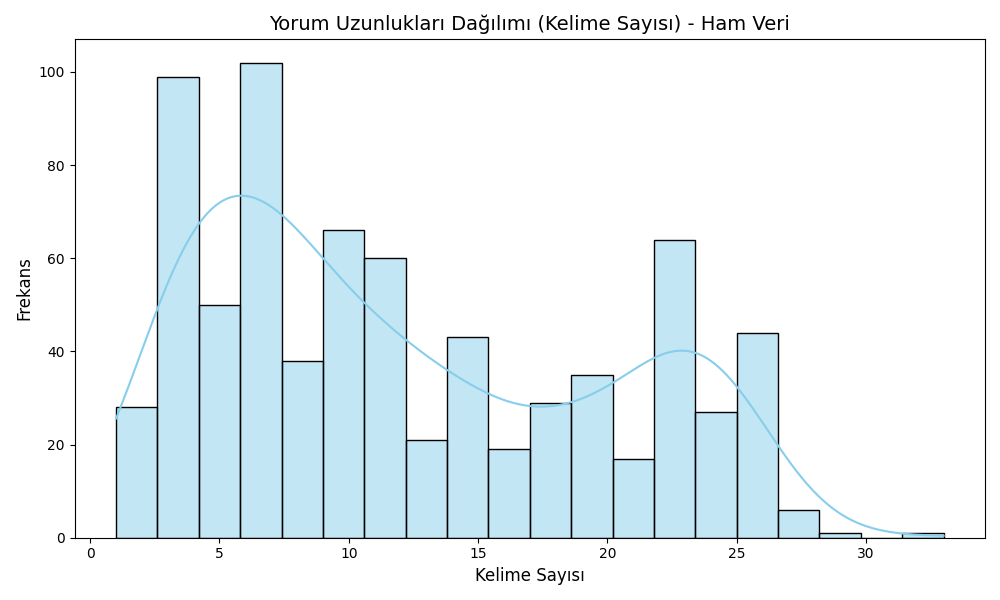
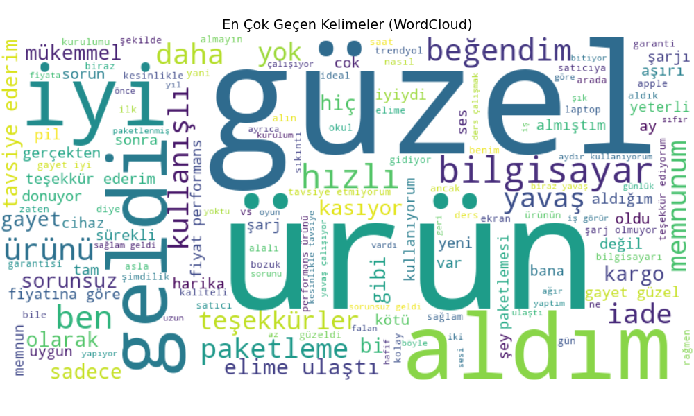
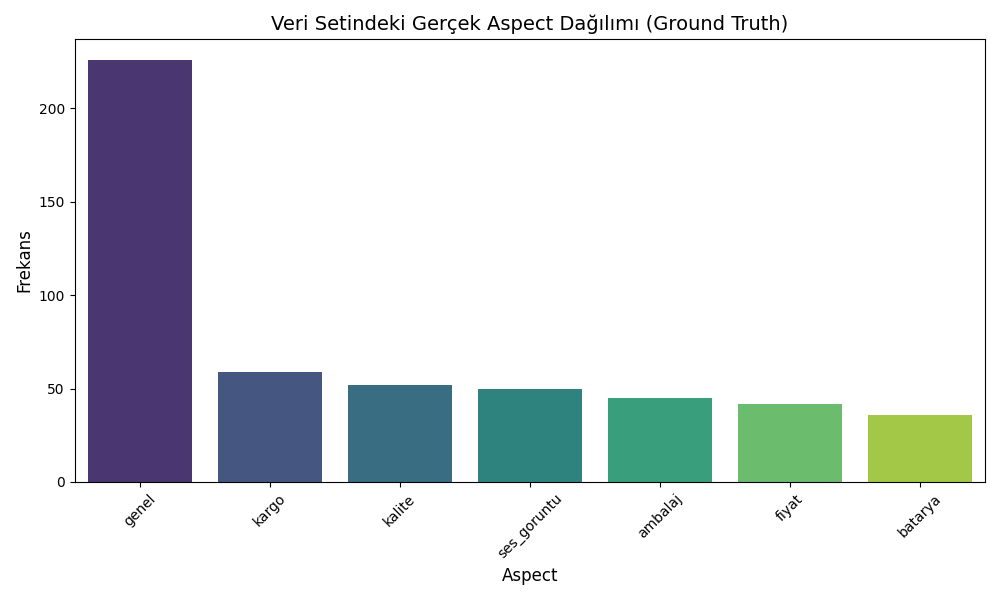
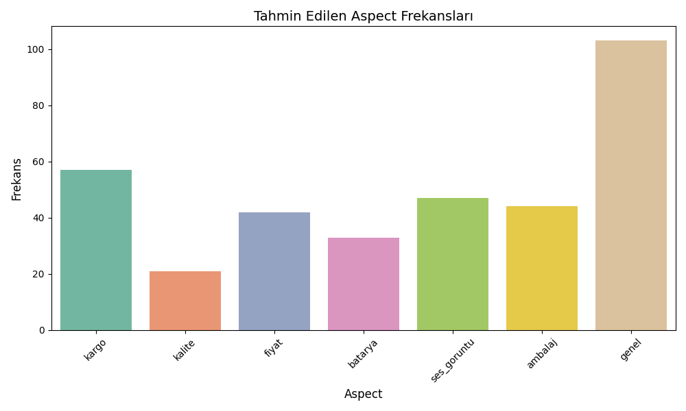
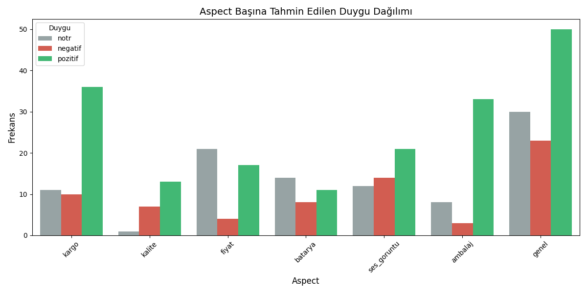

# Yöntem 1 ve 1.5: Kural Tabanlı ve Hibrit ABSA (Aspect-Based Sentiment Analysis)

Bu proje, Trendyol'dan toplanan laptop yorumları üzerinde **Varlık Tabanlı Duygu Analizi (ABSA)** gerçekleştirmek için geliştirilmiştir. Projede iki farklı yaklaşım bulunmaktadır:
1. **Yöntem 1 (Kural Tabanlı):** Tamamen dilbilgisel kurallar ve sözlük (kelime listeleri) üzerinden çalışan temel yaklaşım.
2. **Yöntem 1.5 (Hibrit):** Kural tabanlı sistemin sadece yetersiz kaldığı duygu (sentiment) analiz kısmının çıkartılıp yerine **TF-IDF + Logistic Regression** makine öğrenmesi modelinin eklendiği güçlendirilmiş yaklaşım.

---

##  Temel Çalışma Mantığı (Yöntem 1 - Kural Tabanlı)

Sistem üç ana aşamadan oluşur: **Metin Temizleme → Aspect Tespiti → Sentiment Belirleme**

### 1. Metin Temizleme (Ön İşleme)
Ham yorumlar işlenmeden önce `on_isleme.py` modülü aracılığıyla temizlenir. Uygulanan adımlar sırasıyla şunlardır:

| Adım | Açıklama | Örnek |
|------|----------|-------|
| Küçük Harf | Python'un `lower()` yerine Türkçe-uyumlu dönüşüm yapılır (`İ→i`, `I→ı`) | `"İYİ"` → `"iyi"` |
| URL Temizleme | `http://`, `https://`, `www.` ile başlayan bağlantılar kaldırılır | `"siteye bak www.x.com"` → `"siteye bak"` |
| Emoji Temizleme | Unicode emoji ve semboller silinir | `"harika 🎉"` → `"harika"` |
| Tekrar Normalizasyonu | 3+ ardışık aynı karakter 2'ye düşürülür | `"çoooook"` → `"çook"` |
| Özel Karakter | Noktalama (`. ! ? ,`) ve Türkçe harfler korunur, geri kalan semboller temizlenir | `"ürün** güzel"` → `"ürün güzel"` |
| Boşluk Temizleme | Birden fazla boşluk tek boşluğa indirilir | `"çok  iyi"` → `"çok iyi"` |

### 2. Cümlelere Bölme
Temizlenen yorum iki farklı kurala göre cümlelere ayrılır:
- **Noktalama işaretleri:** `. ! ?`
- **Zıtlık bağlaçları:** `ama`, `fakat`, `ancak`, `lakin` — Bu bağlaçlar çoğunlukla farklı duyguları ayırdığından (örn. *"kargo hızlıydı **ama** batarya kötü"*) bağımsız cümle olarak değerlendirilir.

### 3. Aspect Tespiti
Her cümle, `sozlukler/aspect_sozlugu.py` içindeki kelime listelerine göre taranır. Sistem 7 farklı özelliği tanır:

| Aspect | Örnek Tetikleyici Kelimeler |
|--------|-----------------------------|
| `kargo` | kargo, teslimat, kurye, paket, hızlı geldi |
| `batarya` | batarya, pil, şarj, şarj süresi |
| `fiyat` | fiyat, ücret, para, pahalı, ucuz, fiyat performans |
| `kalite` | kalite, sağlam, dayanıklı, yapı, malzeme |
| `ses_goruntu` | ekran, görüntü, ses, çözünürlük, parlak |
| `ambalaj` | ambalaj, kutu, paketleme, hasar |
| `genel` | Hiçbir spesifik aspect bulunamazsa varsayılan olarak atanır |

Bir cümlede birden fazla aspect bulunabilir; bu durumda her biri için ayrı bir kayıt oluşturulur.

### 4. Sentiment Belirleme (Sadece Yöntem 1)
Aspect bulunan her cümle için `sozlukler/sentiment_sozlugu.py` içindeki pozitif ve negatif kelime listeleri kullanılarak duygu hesaplanır. Algoritma basit bir sayım yöntemine dayanmakla birlikte, **olumsuzlama kalıplarını** da dikkate alır:

```text
"kargo hızlı değil"  → "hızlı" pozitif kelime, "değil" eki var → negatif say
"kötü değil"         → "kötü" negatif kelime, "değil" eki var → pozitif say
```

**Karar Kuralı:**
- Pozitif kelime sayısı > Negatif kelime sayısı → `pozitif`
- Negatif kelime sayısı > Pozitif kelime sayısı → `negatif`
- Eşit ya da sıfırsa → `nötr` (ancak olumsuzlama kalıbı varsa `negatif`)

---

##  Hibrit Çalışma Mantığı (Yöntem 1.5 - TF-IDF + ML)

Kural tabanlı sistem sözlükte tanımlanmayan kelimeleri bilemediği için **Yöntem 1.5** geliştirilmiştir.
- İlk 3 adım (Temizleme, Bölme, Aspect bulma) **birebir aynı** kalır.
- Aspect bulunduktan sonra cümle `[aspect] cümle` formatında (Örn: `[batarya] biraz hızlı bitiyor`) daha önceden eğitilmiş bir **TF-IDF Vectorizer + Logistic Regression** modeline gönderilir.
- Model, cümlenin içeriğinden ve bağlamından yola çıkarak duygu tahmini yapar. (Bkz: `hybrid_pipeline.py`)

---

##  Proje Yapısı

```
.
├── data/                          # Veri dosyaları
│   ├── trendyol_yorumlar_full.csv     # Ham Trendyol verisi (EDA için)
│   ├── laptop_yorumlar_ai_labeled.csv # Etiketlenmiş veri (Eğitim ve Test için)
│   ├── laptop_yorumlar_yontem1_tahminler.csv   # Yöntem 1'in yaptığı tahminler
│   └── laptop_yorumlar_yontem1_5_tahminler.csv # Yöntem 1.5'in yaptığı tahminler
│
├── src/                           # Kaynak kodlar
│   ├── absa_pipeline.py           # YÖNTEM 1 ana çalıştırıcısı (Tamamen kurallı)
│   ├── degerlendir_yontem1.py     # Yöntem 1 Test ve Raporlama Scripti
│   ├── hybrid_pipeline.py         # YÖNTEM 1.5 ana çalıştırıcısı (Hibrit)
│   ├── degerlendir_yontem1_5.py   # Yöntem 1.5 Test ve Raporlama Scripti
│   ├── sentiment_tfidf.py         # ML modelini eğiten ve kaydeden script
│   ├── on_isleme.py               # Metin temizleme
│   └── sozlukler/                 # Kural tabanlı sistem kelime listeleri
│
├── models/                        # Eğitilmiş ML Modelleri
│   ├── sentiment_model.pkl        # Logistic Regression Modeli
│   └── tfidf_vectorizer.pkl       # Kelime vektör haritası
│
├── visuals/                       # Üretilen grafikler
│   └── yontem1_5/                 # Yöntem 1.5'in grafikleri
│
├── docs/, notebooks/, reports/    # Dökümantasyon klasörleri
└── README.md
```

---

##  Çalıştırma: Kendi Veri Setinizle Test Etme

Sistemi farklı, yepyeni bir `.csv` veri seti ile test etmek isterseniz (ister Yöntem 1, ister Yöntem 1.5 ile) aşağıdaki adımları izleyin:

**Adım 1:** Yeni etiketli CSV dosyanızı `data/` klasörünün içine kopyalayın.
>  **ÖNEMLİ:** Test dosyanızda mutlaka `yorum`, `gercek_aspect`, `gercek_sentiment` isminde 3 sütun bulunmalıdır.

**Adım 2:** Hangi yöntemi test edecekseniz o scriptin içine girip dosya yollarını değiştirin:
- **Yöntem 1 için:** `src/degerlendir_yontem1.py` dosyasını açın.
- **Yöntem 1.5 için:** `src/degerlendir_yontem1_5.py` dosyasını açın.

En üstteki **AYARLAR** bölümündeki dosya adını kendi dosya adınızla değiştirin:
```python
ETIKETLI_VERI_YOLU = r"../data/yeni_test_veriniz.csv"
TAHMIN_CSV_YOLU    = r"../data/yeni_test_veriniz_tahminleri.csv"
```

**Adım 3:** Terminali ana dizinde açın ve test komutunu çalıştırın:
```bash
# Sadece Kurallı Sistemi test etmek için:
python src/degerlendir_yontem1.py

# Hibrit (Akıllı) Sistemi test etmek için:
python src/degerlendir_yontem1_5.py
```
> *(Komut çalıştığında sonuçlar anında terminale yazdırılacak ve grafikler `visuals/` klasörüne çizilecektir.)*

---

##  Sonuçların Karşılaştırılması (Yöntem 1 vs Yöntem 1.5)

Model, 730 benzersiz laptop yorumu üzerinde (toplam 5.110 örnek) test edilmiştir. Kural tabanlı sistemin sadece Sentiment adımının ML modeli ile değiştirilmesi (Yöntem 1.5), özellikle "Negatif" ve "Nötr" gibi zor sınıflarda **muazzam bir sıçrama** sağlamıştır.

| Sınıf / Metrik | Yöntem 1 (Kural Tabanlı) | Yöntem 1.5 (Hibrit ML) | Değişim |
|----------------|--------------------------|------------------------|---------|
| **Genel Doğruluk (Accuracy)** | %84.40 | **%87.24** |  **+2.84 puan** |
| **Pozitif (F1-Score)** | 0.63 | **0.68** |  +0.05 |
| **Negatif (F1-Score)** | 0.48 | **0.63** |  **+0.15** |
| **Nötr (F1-Score)** | 0.24 | **0.64** |  **+0.40** |

*Sonuç: Kural tabanlı sistemler "aspect" (özellik) tespitinde çok başarılı olsalar da, kelime sözlüklerinin sınırlılığı duygu analizini zora sokmaktadır. TF-IDF destekli makine öğrenmesi modeli bağlamı daha iyi anladığı için hata payını ciddi oranda düşürmüştür.*

---

##  Görselleştirmeler

### Keşifsel Veri Analizi (EDA)

**Yorum Uzunluğu Dağılımı**
> Yorumların kelime sayısına göre dağılımını gösterir. Çoğu yorumun kısa tutulduğu görülmektedir.



---

**En Çok Geçen Kelimeler (WordCloud)**
> Ham veri üzerinden üretilen genel kelime bulutu. Kullanıcıların en çok hangi kavramlara değindiğini gösterir.



---

**Gerçek Aspect Dağılımı**
> Etiketli veri setindeki aspect'lerin gerçek dağılımı. `genel` ve `kargo` en sık etiketlenen kategorilerdir.



---

### Değerlendirme Sonuçları

**Karmaşıklık Matrisi (Confusion Matrix) - Yöntem 1.5**
> Geliştirilen hibrit sistemin hangi sınıfları doğru, hangilerini hatalı tahmin ettiğini gösterir. Köşegen üzerindeki değerler doğru tahminleri temsil eder.


---

**Tahmin Edilen Aspect Frekansları (Yöntem 1)**
> Kural tabanlı sistemin yorumlarda hangi aspect'i kaç kez tespit ettiğini gösterir.



---

**Aspect Başına Duygu Dağılımı (Yöntem 1)**
> Her aspect için sistemin ürettiği pozitif, negatif ve nötr tahminlerin dağılımı.


