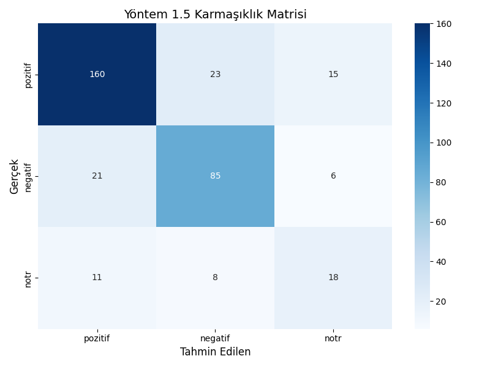
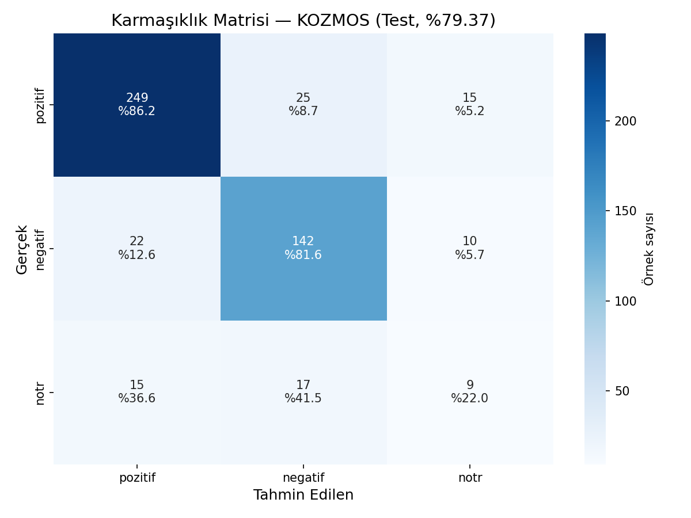

# E-Ticaret Yorumlarında Aspect-Based Duygu Analizi

> Trendyol elektronik kategorisindeki kullanıcı yorumlarından ürün boyutlarını (kargo, kalite, fiyat, batarya, ses/görüntü, ambalaj) tespit ederek her boyut için duygu sınıflandırması yapan veri madenciliği projesi.

## İçindekiler

- [Proje Hakkında](#proje-hakkında)
- [Problem Tanımı](#problem-tanımı)
- [Veri Kaynakları ve Etiketleme](#veri-kaynakları-ve-etiketleme)
- [Aspect Tanımları](#aspect-tanımları)
- [Yöntemler ve Modeller](#yöntemler-ve-modeller)
- [Sonuçların Karşılaştırılması](#sonuçların-karşılaştırılması)
- [Görselleştirmeler](#görselleştirmeler)
- [Proje Yapısı](#proje-yapısı)
- [Kurulum ve Çalıştırma](#kurulum-ve-çalıştırma)
- [Ekip ve Sorumluluk Paylaşımı](#ekip-ve-sorumluluk-paylaşımı)

---

## Proje Hakkında

Bu proje, Kocaeli Üniversitesi Yazılım Mühendisliği 4. Sınıf **Veri Madenciliği** dersi dönem projesi kapsamında hazırlanmıştır. Geleneksel duygu analizinin ötesine geçerek, bir ürün yorumundaki **farklı boyutlara (aspect)** yönelik duyguları ayrı ayrı tespit etmeyi amaçlamaktadır.

Örnek:
> *"Telefonun kamerası harika ama batarya bir günü bile zor götürüyor, kargo hızlıydı."*
> - Kamera (Ses/Görüntü) → **Pozitif**
> - Batarya → **Negatif**
> - Kargo → **Pozitif**

---

## Problem Tanımı

E-ticaret platformlarındaki ürün yorumları, tek bir yıldız puanıyla özetlenemeyecek kadar zengin bilgi içerir. Bir kullanıcı ürünün kalitesinden memnun olurken kargo hizmetinden şikayetçi olabilir. Geleneksel duygu analizi yöntemleri yorumu bütünsel olarak değerlendirdiğinden bu ayrımı yakalayamaz.

**Hedef Çıktılar:**
- Aspect bazlı duygu sınıflandırma modeli (her boyut için pozitif/negatif/nötr tahmini)
- Kural tabanlı yaklaşım ile Modern Derin Öğrenme (KOZMOS, BERTürk) yaklaşımlarının karşılaştırmalı analizi.

---

## Veri Kaynakları ve Etiketleme

Toplamda 3 farklı elektronik kategorisinden (Telefon, Kulaklık, Bilgisayar) **2.250 adet ham yorum** çekilmiştir. Etiketleme işlemi sonucunda **3.358 adet aspect-sentiment çifti** oluşturulmuştur. Model eğitimlerinde `GroupShuffleSplit` kullanılarak yorumların bölünmesi sağlanmış, böylece Veri Sızıntısı (Data Leakage) %0'a indirilmiştir.

| Kategori | Ürünler | Etiketli Çift Sayısı |
|----------|---------|-----------------------|
| Telefon | iPhone 13, iPhone 11, Samsung Galaxy A24 | 1.056 |
| Kulaklık | AirPods 2, AirPods 4, Redmi Buds 6 Play | 1.159 |
| Bilgisayar | MacBook Air M1, Lenovo IdeaPad, Casper | 1.143 |

---

## Aspect Tanımları

| Aspect | Açıklama |
|--------|----------|
| **genel** | Ürün hakkında genel değerlendirme, tavsiye/önermeme |
| **kargo** | Teslimat süreci, kurye, paketleme hızı |
| **kalite** | Ürün yapısı, dayanıklılık, orijinallik, fiziksel kusurlar |
| **fiyat** | Fiyat, fiyat-performans, kampanya |
| **batarya** | Pil ömrü, şarj süresi, ısınma |
| **ses_goruntu** | Ses kalitesi, kamera, ekran, görüntü |
| **ambalaj** | Paketleme, kutu durumu, ezilme/hasar |

---

## Yöntemler ve Modeller

Projede problemi çözmek için 3 temel yaklaşım (ve bir ara hibrit yöntem) geliştirilmiştir:

### 1. Yöntem 1 & 1.5 — Kural Tabanlı ve Hibrit ML 
- **Yöntem 1:** Kelime sözlükleri ve regex kullanılarak cümle bazlı aspect ve duygu tespiti yapar.
- **Yöntem 1.5 (Hibrit):** Aspect tespitini kural tabanlı yapmaya devam ederken, duygu analizi kısmını **TF-IDF + Logistic Regression/SVM** kullanarak gerçekleştirir. Makine öğrenmesi bağlamı öğrendiği için zor sınıflarda başarıyı artırır.

### 2. Yöntem 2 — BERTürk Fine-Tuning 
- `dbmdz/bert-base-turkish-cased` modeli üzerinde fine-tuning yapılarak eğitilmektedir.

### 3. Yöntem 3 — KOZMOS (YTÜ) 
- Yıldız Teknik Üniversitesi tarafından geliştirilen `ytu-ce-cosmos/turkish-small-bert-uncased` modeli kullanılmıştır.
- Yardımcı cümle (auxiliary-sentence) formatı (`{yorum} [SEP] {aspect}`) ile eğitilmiştir.
- Dengeli ağırlıklandırma (`balanced class weight`) ve erken durdurma (early stopping) teknikleri kullanılmıştır.

---

## Sonuçların Karşılaştırılması

Modellerin test verisi üzerindeki genel karşılaştırması aşağıda verilmiştir. Kural tabanlı yöntemlerin makine öğrenmesi ve Transformer tabanlı dil modellerine (KOZMOS) kıyasla zor sınıfları (Negatif, Nötr) tahmin etmedeki değişimi net bir şekilde görülmektedir.

| Metrik | Yöntem 1 (Kural Tabanlı) | Yöntem 1.5 (TF-IDF Hibrit) | Yöntem 3 (KOZMOS) |
|--------|--------------------------|----------------------------|-------------------|
| **Macro F1-Score** | 0.510 | 0.570 | **0.657** |
| **Pozitif (F1)** | 0.68 | 0.65 | **0.88** |
| **Negatif (F1)** | 0.51 | 0.62 | **0.77** |
| **Nötr (F1)** | 0.34 | **0.43** | 0.32 |

> *Not: Nötr sınıfı, verisetindeki örnek azlığı (n=45) ve öznelliği nedeniyle tüm modeller için en zorlayıcı sınıf olmuştur. KOZMOS modeli pozitif/negatif ayrımında devasa bir başarı (%88 / %77 F1) göstermiştir.*

---

## Görselleştirmeler

### Yöntem 1.5 (Hibrit) Karmaşıklık Matrisi
TF-IDF tabanlı Makine Öğrenmesi modelinin tahmin başarıları:


### Yöntem 3 (KOZMOS) Karmaşıklık Matrisi
Transformer tabanlı modelin tahmin başarıları. Kutuplu sınıflar (Pozitif/Negatif) arası karışımın ne kadar düşük olduğuna dikkat ediniz:


---

## Proje Yapısı

```
/
├── README.md
├── requirements.txt
├── .gitignore
├── data/                                        # Ham, işlenmiş ve test verisetleri
│   └── predictions/                             # Modellerin tahmin çıktıları
├── src/                                         # Kural tabanlı ve Hibrit Python scriptleri
├── notebooks/                                   # BERTürk ve KOZMOS model eğitim notebookları
│   ├── 02_berturk_absa.ipynb
│   └── 03_yontem_kozmos.ipynb
├── visuals/                                     # Grafikler ve matrisler
│   ├── kozmos_visuals/
│   └── yontem1_5/
└── docs/                                        # Detaylı değerlendirme raporları
```

---

## Kurulum ve Çalıştırma

Projeyi yerel bilgisayarınızda çalıştırmak için:

```bash
git clone https://github.com/Xhymie/Konu-Bazli-Duygu-Analizi.git
cd Konu-Bazli-Duygu-Analizi

# Sanal ortam oluşturma ve aktif etme
python -m venv .venv
.venv\Scripts\activate        # Windows
# source .venv/bin/activate   # Linux/Mac

# Gerekli kütüphaneleri yükleme
pip install -r requirements.txt
```

---

## Ekip ve Sorumluluk Paylaşımı

| İsim | Görev Alanı |
|------|-------------|
| **Ahmet Çağlar** | Web scraper geliştirme ve veri genişletme (+750 yorum). Telefon ve kulaklık yorumları için hibrit etiketleme pipeline'ı (`etiketle.py`). 3 kategorinin birleştirilmesi ve stratified train/val/test ayrımı. KOZMOS (YTÜ) modeli ile ABSA — `yontem_cozmos` branch. |
| **İbrahim Biner** | Laptop yorumları etiketlemesi. Kural tabanlı ABSA pipeline (Yöntem 1) ve TF-IDF hibrit yaklaşımı (Yöntem 1.5) — `yontem_1` branch. |
| **Dilara Çatalçam** | BERTürk (`dbmdz/bert-base-turkish-cased`) fine-tuning ile ABSA — `yontem_2` branch. EDA görselleştirmeleri ve model değerlendirmesi. |
